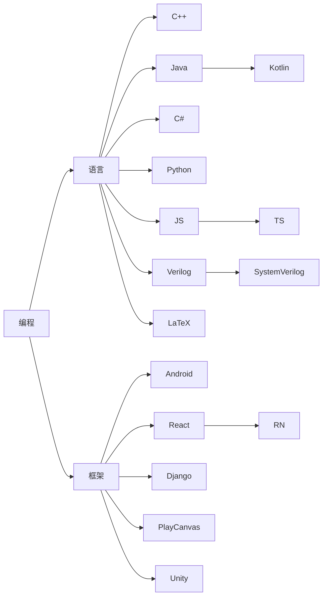

```mermaid
graph LR
	编程-->语言
	编程-->框架
	语言-->C++
	语言-->Java
	Java-->Kotlin
    语言-->C#
	语言-->Python
	语言-->JS
	JS-->TS
	语言-->Verilog
	Verilog-->SystemVerilog
	语言-->LaTeX
	框架-->Android
	框架-->React
    框架-->Django
	框架-->PlayCanvas
    框架-->Unity
    React-->RN
```

