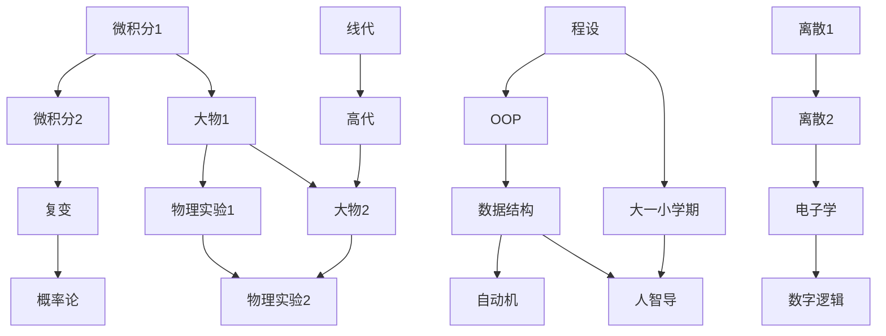
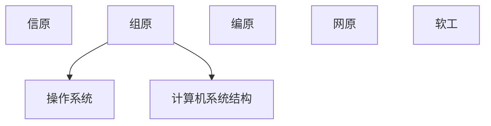

### 2019级计算机系培养方案

以下为2019级培养方案，2020级及以后据说会有不小的变动。

[官方电子版](2019级计算机科学与技术系本科培养方案.pdf)

下图只列出了核心课程，故仅供参考。

因为一张图实在太难画了……所以分成两张图……

（要看完整的一张图版的自行戳上面的官方电子版翻到倒数第二页）

#### 大一大二

#### 大三

（大三春的数值分析与数学实验未画出）

